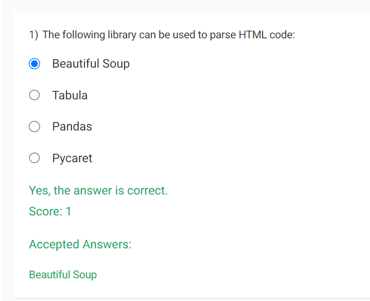
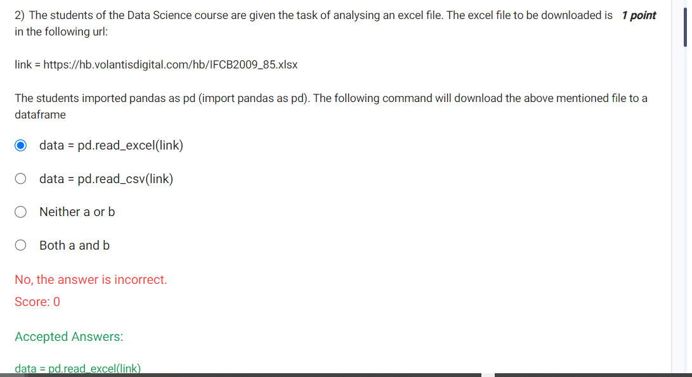
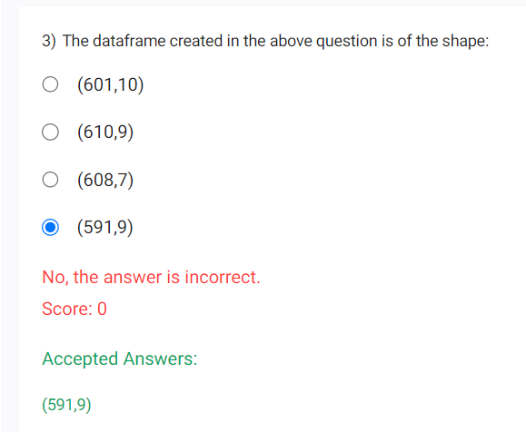
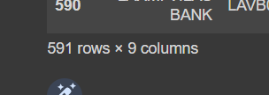
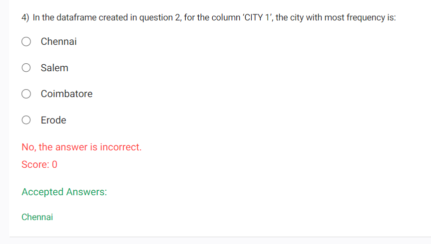
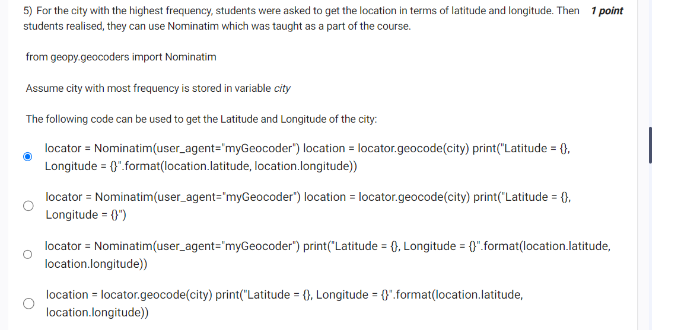
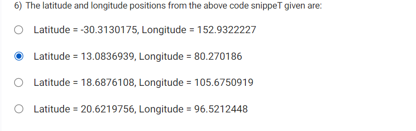

    - Tabula -> to read table data from pdf
        - https://tabula-py.readthedocs.io/en/latest/tabula.html
    - Beautiful Soup - to parse html code
        - https://pypi.org/project/beautifulsoup4/
    - pandas - for dataframe
    - pycaret - PyCaret is an open-source, low-code machine learning library in Python that automates machine learning workflows


```
 data = pd.read_excel("https://hb.volantisdigital.com/hb/IFCB2009_85.xlsx")
display(data)
```

- 

# q.no 4

```
import pandas as pd
data = pd.read_excel("https://hb.volantisdigital.com/hb/IFCB2009_85.xlsx")
# display(data)
x=data['CITY1'].value_counts().idxmax()
x
```

# q.No 5


# q.no 6


# q.no 7
```
import requests

from bs4 import BeautifulSoup

from urllib.parse import urljoin

import os

from google.colab import drive

drive.mount('/content/drive')

url = 'https://www.premierleague.com/publications'

folder_location = r'/content/drive/MyDrive/Colab Notebooks/premier_league'

if not os.path.exists(folder_location):

    os.mkdir(folder_location)

 

response = requests.get(url)

soup = BeautifulSoup(response.text, "html.parser")     

 

for link in soup.select("a[href$='.pdf']"):

    filename = os.path.join(folder_location, link['href'].split('/')[-1])

    with open(filename, 'wb') as f:

        f.write(requests.get(urljoin(url,link['href'])).content)
```